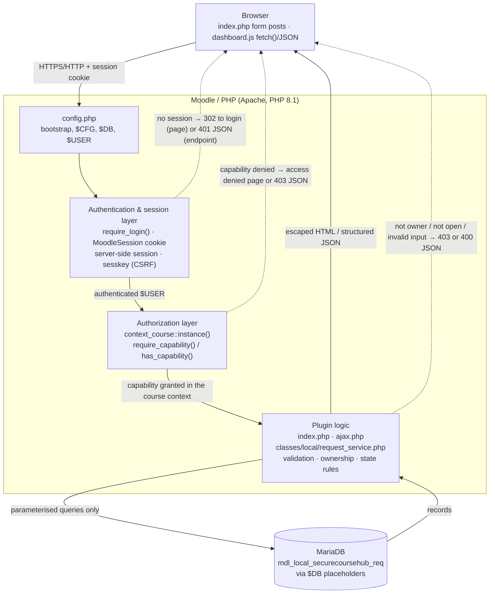

# CSI 3140 — Laboratory 5
## Secure Course Hub: a Moodle local plugin

**Course:** CSI 3140 — WWW Structures, Techniques and Standards
**Term:** Spring/Summer 2026
**Laboratory:** 5 — Moodle-Based Integrated Web Application
**Component:** `local_securecoursehub` (Secure Course Hub)

**Team members**

| Name | Student number |
|---|---|
| TODO(HUMAN) — full name | TODO(HUMAN) |
| TODO(HUMAN) — full name | TODO(HUMAN) |
| TODO(HUMAN) — full name (if a third member) | TODO(HUMAN) |

> **Academic integrity note.** AI assistance was used during development and is
> disclosed here per course and University requirements. Every submitted line has
> been reviewed, tested and can be explained by each team member. No third-party
> code, icons or libraries are bundled; the plugin uses Moodle core APIs and the
> browser's native `fetch()` only.

---

## 1. What Secure Course Hub does

Secure Course Hub is a Moodle **local plugin** that lets students raise short
help or service requests against a course and lets teaching staff triage them.
It deliberately adds no authentication of its own: it integrates with Moodle's
existing accounts, sessions, roles, enrolments and security APIs, which is the
point of the exercise — extending a mature platform safely through its own
extension points rather than rebuilding the platform's security.

### Implemented user stories

| # | As a… | I can… | So that… |
|---|---|---|---|
| 1 | Student | open the hub for a course I am enrolled in | I can get help through a tracked channel |
| 2 | Student | create a request with a title and description | staff know what I need |
| 3 | Student | see only my own requests | other students' issues stay private |
| 4 | Student | edit my request while it is still open | I can correct or add detail |
| 5 | Student | delete my request while it is still open | I can withdraw a request I no longer need |
| 6 | Teacher | see every request in a course I teach | I can manage the queue |
| 7 | Teacher | filter the queue by status | I can focus on what is unhandled |
| 8 | Teacher | set a request to open / in progress / resolved without a page reload | triage is fast |
| 9 | Teacher | attach a response note of at most 500 characters | the student gets an answer |
| 10 | Anyone unauthenticated | reach nothing at all | no course data leaks |

**Deliberately not implemented:** a site-wide `manageall` capability. Management
is scoped to a course on purpose, so a teacher in one course gains no access in
another. This is a security decision, not an omission.

---

## 2. Local environment

Every value below was read from the running instance rather than from
documentation (`$CFG->release`, `$CFG->version`, `PHP_VERSION`).

| Component | Version |
|---|---|
| Moodle | **4.5.4 (Build: 20250414)**, version string `2024100704` |
| PHP | **8.1.32** |
| Database | MariaDB 11.4, `utf8mb4` / `utf8mb4_unicode_ci` |
| Web server | Apache 2.4.63 |
| Container images | `bitnamilegacy/moodle:4.5`, `bitnamilegacy/mariadb:11.4` |
| Site URL | `http://127.0.0.1:8080` (local only, never exposed publicly) |
| Plugin page | `http://127.0.0.1:8080/local/securecoursehub/index.php?courseid=2` |

The environment is reproducible: `docker compose up -d` followed by the
idempotent `setup.sh` (or `setup.ps1`) rebuilds it from nothing, including the
four synthetic accounts, the demonstration course, the enrolments and two sample
requests.

The site must be reached at **`127.0.0.1`, not `localhost`**: Moodle compares the
request host against `$CFG->wwwroot`, and a mismatch silently redirects every
request to the login page.

Developer debugging is enabled (`debug = DEVELOPER`) but **debug display is
disabled** (`debugdisplay = 0`). The developer still gets full diagnostics in the
server log, while no stack trace, SQL fragment or configuration value can reach
an HTTP response. This is the first of several deliberate "useful internally,
silent externally" choices.

### Test accounts (synthetic only)

| Account | Role | Notes |
|---|---|---|
| `admin` | Site administrator | Created by the container install variables |
| `staff1` | Editing teacher | Enrolled in CSI3140-DEMO |
| `learner1` | Student | Enrolled; owns the seeded requests |
| `learner2` | Student | Enrolled; owns nothing — the "attacker" account in the tests |

These map 1:1 to the specification's *administrator / teacher / Student A /
Student B*. No real name, email or password appears anywhere in the project.

---

## 3. Architecture

Every request crosses the same layered boundary. Each layer may only *reduce*
what the request is allowed to do; no layer can grant what an outer layer denied.

> **When exporting to PDF:** if your converter does not render Mermaid, the same
> diagram is available as a static image at `report/architecture_diagram.svg` —
> insert it here instead. A text-only fallback follows the diagram either way.



Text equivalent of the same flow:

```
Browser
  │  request + MoodleSession cookie (+ sesskey in the body for state changes)
  ▼
config.php ─ bootstrap ($CFG, $DB, $USER)
  ▼
Authentication  require_login()            ── no session ──▶ 302 login / 401 JSON
  ▼
Authorization   context_course::instance()
                require_capability()       ── denied ──────▶ access denied / 403 JSON
  ▼
Plugin logic    ajax.php / index.php
                request_service            ── invalid ─────▶ 400 JSON (no write)
                  validation                  not owner ───▶ 403 JSON (no write)
                  ownership + state rules     missing ─────▶ 404 JSON
  ▼
Database        $DB API, placeholders only
  ▼
Response        escaped HTML  ·  structured JSON
```

### Why the layering matters

The single most important structural decision is that **`ajax.php` recomputes
the course context from the stored record**, not from the course id the browser
sent:

```php
$record  = request_service::get($id);                              // MUST_EXIST → 404
$course  = get_course((int) $record->courseid);                    // the record's real course
require_login($course, false, null, false, true);
$context = context_course::instance((int) $record->courseid);
require_capability('local/securecoursehub:managecourserequests', $context);
```

If the context came from the posted `courseid`, a teacher could pass the id of a
course they *do* teach while targeting a record in a course they do not, and the
capability check would wrongly succeed. Deriving the context from the record
closes that path completely.

---

## 4. File structure

```
local/securecoursehub/
├── version.php                        plugin identity: component, version, requires, maturity
├── index.php                          protected page: auth → context → capability → render
├── ajax.php                           JSON endpoint: the same chain, plus sesskey, for every action
├── lib.php                            adds the plugin link to the course navigation
├── styles.css                         light styling only
├── README.md                          install, accounts, permissions, tests, limitations
├── db/
│   ├── access.php                     the three capability definitions + archetypes
│   └── install.xml                    XMLDB definition of the request table
├── classes/
│   ├── local/request_service.php      all business rules and all database access
│   └── privacy/provider.php           Privacy API: metadata, export, deletion
├── lang/en/local_securecoursehub.php  every user-visible string, including error text
└── amd/
    ├── src/dashboard.js               fetch()/JSON client logic
    └── build/dashboard.min.js         the module Moodle serves in production mode
```

| File | Why it exists |
|---|---|
| `version.php` | Identifies the component to Moodle and drives install/upgrade. `version` is bumped whenever `install.xml` changes. |
| `db/access.php` | Declares the three capabilities at `CONTEXT_COURSE` with default archetypes. Declaration alone grants nothing — each is enforced in code. |
| `db/install.xml` | Creates `local_securecoursehub_req` with indexes on `courseid` and `userid`. |
| `index.php` | The only rendered page. Runs the security chain, then draws the student form, the user's own requests, and — only with the management capability — the course queue. |
| `ajax.php` | Single JSON endpoint for all six actions. POST only; every action validates the sesskey. |
| `request_service.php` | The only place that touches the table. Holds validation, ownership, state transitions and timestamps, so no page script can bypass a rule. |
| `provider.php` | Declares the personal data stored and implements export/deletion. |
| `dashboard.js` | Sends JSON with `fetch()` and updates the DOM with `textContent`. |

Separation of concerns is the maintainability argument *and* a security
argument: because every write funnels through `request_service`, a rule is
enforced once and cannot be forgotten in a new entry point.

---

## 5. Data model

One table, `local_securecoursehub_req` (physically `mdl_local_securecoursehub_req`).

| Field | Type | Null | Notes |
|---|---|---|---|
| `id` | int(10), auto-increment | no | Primary key |
| `courseid` | int(10) | no | Course the request belongs to; indexed |
| `userid` | int(10) | no | **Owner** — always the authenticated creator; indexed |
| `title` | char(80) | no | Enforced at 80 characters server side |
| `description` | text | no | Enforced at 2000 characters server side |
| `status` | char(20), default `open` | no | Whitelist: `open`, `inprogress`, `resolved` |
| `response` | text | yes | Staff note, at most 500 characters |
| `timecreated` | int(10) | no | Server `time()`, never a client value |
| `timemodified` | int(10) | no | Server `time()`, updated on every write |

Indexes: `courseid`, `userid`, and a composite `courseid,status` for the teacher
queue with its status filter.

Design notes:

- `userid` is the ownership anchor for the entire authorization model. It is set
  from `$USER->id` and is never accepted from a request payload.
- `status` is constrained in PHP against an explicit whitelist rather than by a
  database enum, so an invalid value is rejected with a clear 400 before it ever
  reaches the driver — and the same whitelist is reused for the filter, the
  select menu and the update path.
- Timestamps are always server-generated, so a client cannot backdate a record.
- `title` is `char(80)` and the PHP limit is also 80: the validation layer and
  the schema agree, so an overlength value is rejected rather than truncated.

---

## 6. Authentication and session workflow

The plugin implements no authentication. It consumes Moodle's.

1. The user posts credentials to Moodle's `/login/index.php`, which itself
   carries a `logintoken` (Moodle's CSRF protection for the login form).
2. Moodle verifies the credentials, creates **server-side session state**, and
   sends a `MoodleSession` cookie holding only an opaque session **identifier**.
3. Moodle answers with a redirect to `login/index.php?testsession=<id>`; the
   session is confirmed once that round trip completes. (Our test harness must
   follow that redirect with `curl -L`, or the next request is anonymous — a
   detail that cost real debugging time.)
4. On each later request, `config.php` bootstraps, the cookie is matched to the
   stored session, and `$USER` is populated **by the platform**.
5. `require_login($course)` then guarantees three things: a session exists, the
   user is not a guest, and the user can access that course. On a page it
   redirects to the login form; on `ajax.php` — where `AJAX_SCRIPT` is defined
   and `$preventredirect` is passed — it throws, and we translate that into a
   JSON 401 rather than an HTML login page a `fetch()` could not use.

### Session cookie vs server-side session vs sesskey

These three are constantly confused, so the distinction is stated explicitly:

| | What it is | Where it lives | What it protects against |
|---|---|---|---|
| **`MoodleSession` cookie** | An opaque random session **id** | Sent by the browser on every same-origin request | Nothing by itself — it only *identifies* the session |
| **Server-side session** | The actual state (user id, roles, timeouts) | On the server, keyed by the cookie | Tampering — the browser holds no user data it could edit |
| **`sesskey`** | A per-session token echoed **in the request body**, not automatically attached | Rendered into the page; sent explicitly by our code | **CSRF** — a third-party site can make the browser send the cookie, but cannot read the page to learn the sesskey |

The cookie authenticates *who*; the sesskey proves the request was *intentionally
issued by our own page*. A cookie alone cannot distinguish a genuine click from a
forged cross-site form submission, which is exactly why every state-changing
action validates the sesskey as well.

**Logout / expiry.** Destroying the session invalidates the cookie's server-side
counterpart. The next `fetch()` fails `require_login()`, returns HTTP 401 with
`{"success": false, "error": "Your session has expired…"}`, and `dashboard.js`
displays that message and stops — it does not retry and does not silently
discard the user's typed text.

**Session safety.** No session identifier or sesskey is printed, logged, written
to a project file, or included in a screenshot. The test harness explicitly
redacts them as `<redacted>` before writing `tests/evidence.txt`.

---

## 7. Roles, capabilities, contexts and the access-control matrix

Three capabilities, all at `CONTEXT_COURSE` — the correct level, because access
here is meaningful per course, not site-wide.

| Capability | Type | Risk | Default archetypes |
|---|---|---|---|
| `local/securecoursehub:viewown` | read | — | student, editingteacher, manager |
| `local/securecoursehub:createrequest` | write | — | student, editingteacher, manager |
| `local/securecoursehub:managecourserequests` | write | `RISK_PERSONAL` | editingteacher, manager |

`RISK_PERSONAL` on the management capability is accurate and deliberate: holding
it means reading text other people wrote about their own difficulties.

### Access-control matrix

Rows are operations; ✅ = permitted, ❌ = refused by the server with the HTTP
status shown. "Own" means the record's `userid` equals the authenticated user id.

| Operation | Unauthenticated | Student (own record) | Student (another's record) | Teacher (course they teach) | Teacher (other course) | Manager |
|---|---|---|---|---|---|---|
| Open the page | ❌ 302 → login | ✅ | — | ✅ | ❌ access denied | ✅ |
| `create` | ❌ 401 | ✅ | — | ✅ | ❌ 403 | ✅ |
| `list_own` | ❌ 401 | ✅ own only | ❌ never returned | ✅ own only | ❌ 403 | ✅ |
| `list_course` | ❌ 401 | ❌ 403 | ❌ 403 | ✅ | ❌ 403 | ✅ |
| `update_own` | ❌ 401 | ✅ if `open` / ❌ 400 if not | ❌ 403 | ✅ own only | ❌ 403 | ✅ own only |
| `update_status` | ❌ 401 | ❌ 403 | ❌ 403 | ✅ | ❌ 403 | ✅ |
| `delete` | ❌ 401 | ✅ if `open` / ❌ 400 if not | ❌ 403 | ✅ any in course | ❌ 403 | ✅ any in course |

`require_capability()` is used wherever access is mandatory; `has_capability()`
is used **only** to decide which interface to draw. The teacher panel is hidden
from students for usability, and the server refuses the same operations anyway —
proven by test 09, where `learner1` calls `update_status` directly with no
button involved and receives 403.

---

## 8. Ownership and resource-level authorization

Role checks answer "what kind of user is this?". They cannot answer "is this
*their* record?". Both questions are asked.

```php
private static function require_owner(stdClass $record, int $userid): void {
    if ((int) $record->userid !== $userid) {
        throw new moodle_exception('notowner', 'local_securecoursehub');
    }
}

private static function require_open(stdClass $record): void {
    if ($record->status !== self::STATUS_OPEN) {
        throw new moodle_exception('requestnotopen', 'local_securecoursehub');
    }
}
```

Rules enforced:

1. **Reads are filtered at the query, not after it.** `list_own()` passes
   `['courseid' => $courseid, 'userid' => $userid]` to `$DB->get_records()`, so
   another user's row is never loaded into memory in the first place.
2. **Writes load, then verify, then write.** Record-targeted actions fetch with
   `MUST_EXIST`, verify ownership (or the management capability in the record's
   own course), verify the state rule, and only then write.
3. **State is part of authorization.** A student may edit or delete only while
   the request is `open`. Once staff have engaged with it, the student can no
   longer alter or erase the record.
4. **Teachers are bounded by course, not by role.** The management capability is
   evaluated in the context derived from `$record->courseid`.
5. **Nothing from the client is authorization evidence** — not hidden fields,
   not a posted `userid`, not a posted `courseid`, not a claimed role.

**Not-found vs forbidden.** A missing record returns 404 with a fixed message; a
record that exists but is not yours returns 403. Both messages are constant and
reveal nothing about other records' contents.

---

## 9. JSON and the dynamic interface

### The required state-changing operation

The teacher status update is implemented with `fetch()` and JSON and updates the
page with no reload. Student creation is wired the same way, so a new row appears
dynamically too. Both forms still work with JavaScript disabled by posting to
`index.php`, which applies the identical checks.

### Example exchange (captured from the automated run)

Request — `POST /local/securecoursehub/ajax.php`, `Content-Type: application/json`:

```json
{
  "action": "update_status",
  "id": 1,
  "status": "inprogress",
  "response": "",
  "sesskey": "<redacted>"
}
```

Response — `200 OK`, `Content-Type: application/json; charset=utf-8`:

```json
{
  "success": true,
  "message": "The request status was updated.",
  "request": {
    "id": 1,
    "courseid": 2,
    "title": "Cannot open week 3 lab handout",
    "description": "The PDF link on the week 3 page returns a not-found page for me. Could the file be re-uploaded?",
    "status": "inprogress",
    "statuslabel": "In progress",
    "response": "",
    "timecreated": 1784662101,
    "timemodified": 1784662542,
    "timemodifiedformatted": "Tuesday, 21 July 2026, 8:35 PM",
    "userid": 4,
    "ownername": "Alex StudentA"
  }
}
```

Failure responses use the same shape, so the client has one code path:

```json
{ "success": false, "error": "You do not have permission to perform this action." }
```

| Situation | HTTP | Client behaviour |
|---|---|---|
| Network failure | — | "The request could not reach the server…" |
| Body is not JSON | — | "The server returned an unreadable response." |
| Session expired / logged out | 401 | Shows the session message and stops |
| Forbidden (capability or ownership) | 403 | Shows the server's message |
| Missing record | 404 | Shows a neutral not-found message |
| Validation error | 400 | Shows which rule failed |
| Missing/invalid sesskey | 403 | Shows "reload the page and try again" |

### Client-side rules

- `credentials: 'same-origin'` — the session cookie travels automatically to our
  own origin. **No authentication secret is ever copied into JavaScript**; the
  sesskey comes from `M.cfg.sesskey`, which Moodle already places in the page.
- Every server value reaches the DOM through `textContent` or `createElement`.
  `innerHTML` is never used with server data, which is why the stored
  `<script>alert(1)</script>` title renders as visible text rather than running.
- Buttons are disabled during a request to prevent double submission.
- **Every client restriction is duplicated on the server.** The client hides the
  teacher panel from students, limits the title field with `maxlength`, and only
  offers whitelisted statuses in the select menu — and the server independently
  re-checks the capability, the length and the whitelist, because all three
  client controls can be removed with the browser's developer tools.

---

## 10. Validation, error handling and database safety

### Input validation (all server side)

| Field | Rules |
|---|---|
| `courseid`, `id` | `PARAM_INT`, must be > 0; the course must exist and be reachable |
| `action` | Must be a key of an explicit action whitelist |
| `title` | Required, trimmed, ≤ 80 characters (`core_text::strlen`, so multibyte-safe) |
| `description` | Required, trimmed, ≤ 2000 characters |
| `response` | Optional, trimmed, ≤ 500 characters |
| `status` | Must be exactly one of `open`, `inprogress`, `resolved` |
| `sesskey` | Must match the session's token |

Validation runs **before** any write, and a rejected request performs no write at
all — no partial or half-applied update is possible. Tests 04, 05, 12 and 17
verify the row count or the stored value is unchanged after each rejection.

### XSS

Untrusted text is **stored verbatim and escaped at output**. This is a conscious
choice over stripping tags at input: stripping destroys user data (a student
legitimately pasting `<div>` in a description loses it) and creates a false sense
of safety, because the same value may later be rendered in a context the strip
did not anticipate. Escaping at the point of output is correct in every context.

- HTML: `s()`, `format_string()` and `html_writer` attribute escaping.
- JavaScript: `textContent` / `createElement`, never `innerHTML`.

Test 15 proves the round trip: a request titled `<script>alert(1)</script>` is
stored with its tags intact, and the rendered page contains
`&lt;script&gt;alert(1)&lt;/script&gt;` with **zero** executable occurrences.

### CSRF

Every state-changing request carries a sesskey and the server validates it:
`confirm_sesskey()` in `ajax.php` for all six actions, `require_sesskey()` for
every form POST in `index.php`. GET never changes state, and `ajax.php` rejects
any method other than POST with 405. Test 14 confirms that both a missing and a
wrong sesskey are refused with 403 and that the stored status is unchanged.

### Injection prevention

Every query goes through the Moodle Database API with placeholders —
`get_records()`, `get_record()`, `insert_record()`, `update_record()`,
`delete_records()`, and `get_in_or_equal()` in the privacy provider. **No user
input is concatenated into SQL anywhere in the plugin.** The status filter is
whitelisted before it is used as a condition, so even the one value that reaches
a `WHERE` clause as data is constrained to three known strings.

### Safe errors

`ajax.php` returns a message only when the error code appears in an explicit map
of this plugin's own language strings:

```php
const LOCAL_SECURECOURSEHUB_SAFE_ERRORS = [
    'invalidjson' => 400, 'invalidaction' => 400, 'validationerror' => 400,
    'titleinvalid' => 400, 'descriptioninvalid' => 400, 'responseinvalid' => 400,
    'statusinvalid' => 400, 'requestnotopen' => 400,
    'notowner' => 403, 'notenrolled' => 403, 'accessdenied' => 403,
    'notfound' => 404,
];
```

Anything else — a `dml_write_exception`, a `TypeError`, any unforeseen
`moodle_exception` — is logged locally with `debugging()` and answered with a
generic "The operation could not be completed." No stack trace, SQL fragment,
file path, configuration value, cookie or sesskey can reach a client. Test 16
explicitly asserts that a 404 response contains no SQL text and no server path.

---

## 11. Privacy analysis

**Data collected.** Only what the feature needs: the course, the owner's user id,
a title, a description, a status, an optional staff response, and two timestamps.
Deliberately *not* collected: IP addresses, browser fingerprints, request
categories, read receipts, or any free-text field about a third party. Names are
never stored in the table — the owner is a foreign-key-style `userid`, and a
display name is resolved from Moodle's user table only when rendering the page
for someone already authorised to see it.

**Who can access it.**

| Data | Who can read it |
|---|---|
| A request's title, description, status | Its owner; users with `managecourserequests` in that course; site administrators |
| The staff response | The same set |
| The owner's name | Only users with `managecourserequests` in that course (students never see another student's identity through this plugin) |

The queue is scoped to one course, so a teacher sees only requests from the
course they teach — this is why `manageall` was deliberately not implemented.

**Retention assumption.** Requests persist for the life of the course. There is
no automatic purge; the assumption documented here is that records are removed
with the course, or earlier on request. Because the plugin implements Moodle's
Privacy API (`classes/privacy/provider.php`), a data subject's records can be
**exported** and **deleted** through Moodle's standard privacy tooling, at
whole-context, per-user and per-user-list granularity.

**Data minimisation in practice.** Three concrete decisions:

1. `list_own` filters by `userid` in the SQL, so another student's row is never
   loaded, let alone rendered.
2. The JSON row builder only includes the owner's identity when the caller has
   already been verified to hold the management capability
   (`to_json_row($record, $includeowner = true)`), so a student's `list_own`
   response contains no `userid` or name field at all.
3. Error messages are constant. "The requested record was not found" is returned
   whether or not the record exists, so the endpoint cannot be used to enumerate
   which requests exist or who owns them.

---

## 12. Security controls mapped to risks

| Risk | Control implemented | Where | Evidence |
|---|---|---|---|
| **Broken access control** (OWASP A01) | Capabilities checked server-side in the *record's own* course context, plus ownership and state rules; UI hiding is never relied upon | `ajax.php` context recomputation; `request_service::require_owner()` / `require_open()` | Tests 08, 09, 10 |
| **CSRF** (A01/A05) | `sesskey` required and validated on every state-changing request; POST-only endpoint; GET never mutates | `confirm_sesskey()` in `ajax.php`, `require_sesskey()` in `index.php` | Test 14 |
| **Injection** (A03) | Moodle `$DB` API with placeholders exclusively; status whitelist; typed `PARAM_*` cleaning | `request_service.php` throughout | Test 17; code review — no SQL concatenation exists |
| **XSS** (A03) | Escape at output: `s()` / `format_string()` / `html_writer`; `textContent` in JS, never `innerHTML` | `index.php`, `dashboard.js` | Test 15 (1 escaped, 0 executable) |
| **Identification & authentication failures** (A07) | Moodle's own login/session used; no separate password store; `$USER` from the platform; expired sessions produce 401 and the client stops | `require_login()` on both entry points | Tests 01, 02 |
| **Security misconfiguration** (A05) | Debug display disabled while developer debugging stays on; site bound to `127.0.0.1`; synthetic credentials only; no core file modified | `seed_testdata.php`, `docker-compose.yml` | Environment section |
| **Security logging & monitoring failures** (A09) | Unexpected failures logged locally via `debugging()`; logs contain no passwords, cookies, sesskeys or request text | `ajax.php` catch blocks | Test 16 |
| **Sensitive data exposure** (A02) | Constant not-found/forbidden messages; owner identity omitted from student responses; secrets scanned out of the ZIP | `to_json_row()`, `package.sh` | Test 16; packaging scan |

---

## 13. Test results

17 automated checks, all passing on a clean instance. The harness logs in through
the real Moodle login form and then calls `ajax.php` **directly**, with no
interface involved — the point being that every rule must hold against a hostile
client. Full output, including exact HTTP codes and response bodies, is in
`tests/evidence.txt`. Session cookies and sesskeys are redacted there.

| # | Role | Action | Expected | Actual | Result |
|---|---|---|---|---|---|
| 01 | anonymous | GET the plugin page | Redirect to login, no data | HTTP 303 to login | **PASS** |
| 02 | anonymous | POST `create` to `ajax.php` | Rejected before any write | HTTP 401, row count unchanged | **PASS** |
| 03 | learner1 | `create` a valid request | Owner=learner1, course=2, status=open, timestamps set | HTTP 200; stored row `4\|2\|open\|1\|1` | **PASS** |
| 04 | learner1 | `create` with an empty title | Safe validation error, no write | HTTP 400, row count unchanged | **PASS** |
| 05 | learner1 | `create` with a 100-char title | Rejected (limit 80), no write | HTTP 400, row count unchanged | **PASS** |
| 06 | learner1 | `list_own` | Exactly the caller's records | HTTP 200, 3 of 3 own records | **PASS** |
| 07 | learner2 | `list_own` | learner1's records absent | HTTP 200, `{"requests":[]}` | **PASS** |
| 08 | learner2 | `update_own` + `delete` on learner1's record id | 403 both, record unchanged | HTTP 403 + 403, record identical | **PASS** |
| 09 | learner1 | `update_status` (teacher-only) directly | 403, status unchanged | HTTP 403, status still `open` | **PASS** |
| 10 | staff1 | `list_course` | All course records | HTTP 200, 3 of 3 | **PASS** |
| 11 | staff1 | `update_status` → `inprogress` | 200, stored status updated | HTTP 200, stored `inprogress` | **PASS** |
| 12 | staff1 | 501-character response | Rejected, nothing stored | HTTP 400, length not 501 | **PASS** |
| 13 | staff1 | 500-character response | Accepted | HTTP 200, length 500 | **PASS** |
| 14 | staff1 | Missing sesskey, then wrong sesskey | 403 both, data unchanged | HTTP 403 + 403, status unchanged | **PASS** |
| 15 | learner1 | Create title `<script>alert(1)</script>` | Stored; rendered as text | Stored; 1 escaped, 0 executable | **PASS** |
| 16 | staff1 | Operate on record id 99999 | Safe 404, no internal detail | HTTP 404, no SQL/paths in body | **PASS** |
| 17 | staff1 | `status` = `deleted` | 400, status unchanged | HTTP 400, status unchanged | **PASS** |

**Totals: 17 passed, 0 failed.**

### Manual checks (browser-only)

| # | Check | Result |
|---|---|---|
| M1 | Site and version page load without fatal errors | TODO(HUMAN) — confirm and screenshot |
| M2 | Participants page shows all three users with correct roles | TODO(HUMAN) |
| M3 | Network tab shows the JSON request and response | TODO(HUMAN) |
| M4 | Log out in a second tab, then press Update → session error, client stops | TODO(HUMAN) |
| M5 | No unexplained console, PHP or database errors | TODO(HUMAN) |

---

## 14. Screenshots

Capture the images listed in `screenshots/SCREENSHOTS_NEEDED.md` and insert them
here with the captions below. **No cookie, sesskey, password or credential may be
visible in any image.**

| Figure | File | Caption |
|---|---|---|
| 1 | `01-site-running.png` | TODO(HUMAN) — Moodle 4.5.4 running locally with PHP 8.1.32 |
| 2 | `02-participants-roles.png` | TODO(HUMAN) — Participants page: staff1 (Teacher), learner1 and learner2 (Students) |
| 3 | `03-plugin-page-learner1.png` | TODO(HUMAN) — learner1 sees only their own requests |
| 4 | `04-denied-learner2.png` | TODO(HUMAN) — learner2 denied on learner1's record (403) |
| 5 | `05-teacher-panel-status-change.png` | TODO(HUMAN) — staff1 changes a status with no page reload |
| 6 | `06-network-json.png` | TODO(HUMAN) — the JSON request/response in DevTools |
| 7 | `07-xss-rendered-as-text.png` | TODO(HUMAN) — injected script shown as text, not executed |
| 8 | `08-sesskey-rejected.png` | TODO(HUMAN) — state change without a valid sesskey rejected |

---

## 15. Integration and security checklist (Section 15)

| Item | Completed |
|---|---|
| The local Moodle site runs correctly and the version is documented | ✅ 4.5.4 (Build: 20250414), PHP 8.1.32 |
| The plugin installs through Moodle without modifying core files | ✅ CLI upgrade; nothing outside `local/securecoursehub` |
| The demonstration course and required test accounts are configured | ✅ CSI3140-DEMO + 4 synthetic accounts |
| Every protected page or endpoint verifies login | ✅ `require_login()` in `index.php` and `ajax.php` |
| Capabilities are defined in `db/access.php` | ✅ three capabilities |
| Authorization checks use the correct system or course context | ✅ `CONTEXT_COURSE`, recomputed from the record |
| Student ownership is checked for record-level operations | ✅ `require_owner()` + query-level filtering |
| Teacher access is limited to authorized course records | ✅ capability in the record's own course |
| The plugin uses Moodle's Database API | ✅ `$DB` with placeholders only |
| Input is validated on the server | ✅ type, presence, length, whitelist |
| State-changing requests validate sesskey/CSRF protection | ✅ all six actions and all form posts |
| Output escaped and injected scripts do not execute | ✅ test 15 |
| At least one JSON/fetch interaction works dynamically | ✅ teacher status update, plus student create |
| Client-side restrictions are duplicated by server-side checks | ✅ test 09 proves it |
| Unauthenticated and forbidden cases are tested | ✅ tests 01, 02, 08, 09 |
| Invalid input and missing records are tested | ✅ tests 04, 05, 12, 16, 17 |
| No passwords, cookies, sesskeys, config.php or moodledata are submitted | ✅ enforced by `package.sh` secret scan |
| The README explains installation, permissions, execution and testing | ✅ |
| The report explains architecture, AuthN, AuthZ, sessions, security, privacy and testing | ✅ this document |

---

## 16. Reflection

### Problems encountered and how they were solved

1. **Authorization context could be spoofed.** An early version derived the
   course context from the `courseid` in the request body. A teacher could then
   present a course they legitimately teach while targeting a record elsewhere.
   Fixed by loading the record first and deriving the course and context from
   `$record->courseid`. This is the single most important change made.

2. **A stale schema shipped silently.** The table was initially created under an
   old name because an edit to `install.xml` did not land before the first
   install. Because Moodle only runs `install.xml` once, the fix required
   uninstalling the plugin and reinstalling it — a reminder that
   `$plugin->version` must be bumped for every schema change, and that "it
   installed successfully" is not the same as "it installed what you meant".

3. **The test harness authenticated but had no session.** Moodle answers a
   successful login with a redirect to `login/index.php?testsession=<id>`, and
   the session is only confirmed after that round trip. Without `curl -L` every
   subsequent request was anonymous and returned 401 — which initially looked
   like a plugin bug rather than a harness bug.

4. **`pipefail` broke a `grep -q` guard.** `printf … | grep -q` returns failure
   under `set -o pipefail` because `grep -q` exits at the first match and
   SIGPIPEs the writer. The login check was rewritten as a pure-bash substring
   test. A good reminder that a test harness reporting a failure is not proof
   that the system under test is broken.

5. **Store-raw vs strip-on-input for XSS.** Stripping tags at input was
   considered and rejected: it silently destroys legitimate user text and only
   protects the contexts anticipated at write time. Escaping at output is
   correct in every context, and it makes the security property demonstrable —
   the injected string is visibly stored and visibly rendered as text.

### Known limitations

- Course-scoped management only; no site-wide `manageall` capability.
- A staff response replaces the previous note; there is no history or audit
  trail of who changed a status and when.
- Deletion is immediate and permanent — no soft delete, no restore.
- The teacher queue loads the full course list; a paged query would be needed at
  large scale.
- No retention job; records persist until the course or the data subject's
  records are removed.
- English strings only.

### TODO(HUMAN) — demonstration reflection

After the TA demonstration, add a short paragraph covering: which part the team
found hardest to explain, one thing that would be designed differently with more
time, and each member's contribution.

---

## 17. References

1. Moodle Developer Documentation — *Local plugins* and *Common plugin files*.
   <https://moodledev.io/docs/apis/plugintypes/local>
2. Moodle Developer Documentation — *Access API* (roles, capabilities, contexts,
   `require_login()`, `require_capability()`).
   <https://moodledev.io/docs/apis/subsystems/access>
3. Moodle Developer Documentation — *Database API* (`$DB`, placeholders).
   <https://moodledev.io/docs/apis/core/dml>
4. Moodle Developer Documentation — *XMLDB* schema definitions.
   <https://moodledev.io/general/development/tools/xmldb>
5. Moodle Developer Documentation — *Output API* and escaping helpers
   (`s()`, `format_string()`, `html_writer`).
6. Moodle Developer Documentation — *Privacy API*.
   <https://moodledev.io/docs/apis/subsystems/privacy>
7. Moodle Docs — *Security guidelines*: unauthorised access, CSRF (`sesskey`),
   XSS, input/output handling.
   <https://moodledev.io/general/development/policies/security>
8. Moodle Developer Documentation — *JavaScript modules (AMD)*.
   <https://moodledev.io/docs/guides/javascript>
9. OWASP Top 10 (2021) — used for the risk mapping in section 12.
   <https://owasp.org/Top10/>
10. CSI 3140 — Chapter 15, *Authenticating and Authorizing Requests*.
11. CSI 3140 — Laboratory 4, *Client-Server Interaction and Modern Web Services*.
