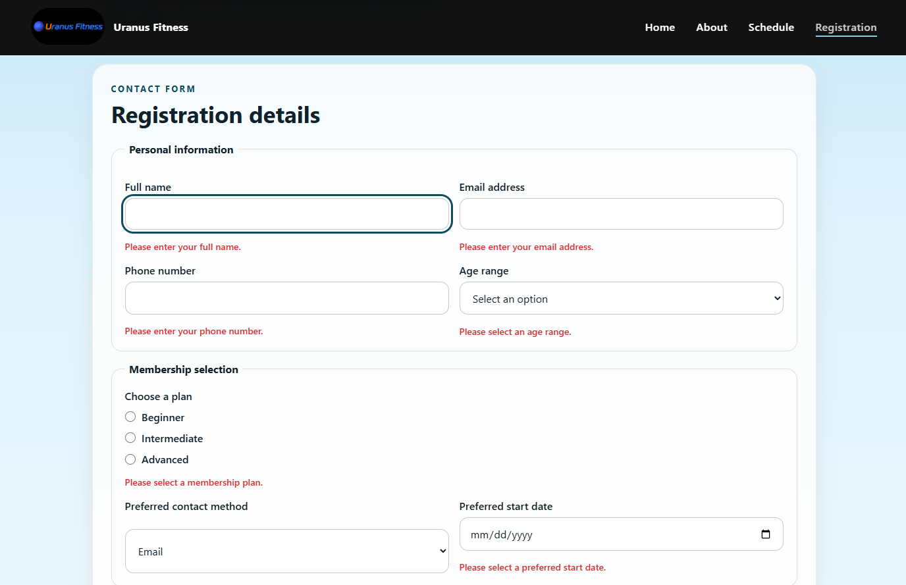
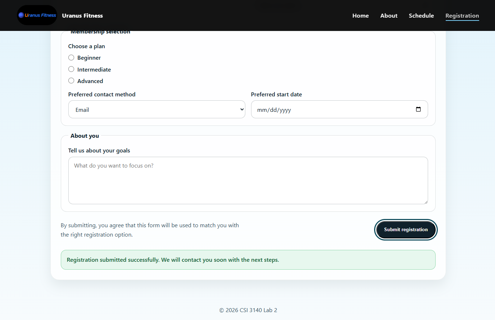

# CSI 3140 Lab 3 Report: JavaScript Implementation

## Course Information
- **Course Code:** CSI 3140
- **Lab Number:** Lab 3
- **Team Members:**
  - David Gvozdyev - 300308910
  - Liam Geraghty - 300356748
  - Neelman Bhardwaj - 300389998
- **Date Submitted:** [Date]

---

## Website Overview

### Topic Description
Uranus Fitness is a community-focused fitness training website designed to provide a clear schedule, straightforward registration process, and a platform for users to build healthier habits. The website serves as a digital hub for gym members to view class schedules, register for membership, and access information about the fitness programs offered.

### Interaction Goals
1. **Home Page (index.html):** Engage visitors with a welcoming interactive modal that introduces the website and encourages exploration
2. **About Page (about.html):** Let users browse common questions through an accordion FAQ without leaving the page
3. **Schedule Page (schedule.html):** Allow users to filter and sort training plans to quickly find the right option
4. **Registration Page (registration.html):** Validate user input and provide clear inline feedback to ensure data quality before submission

---

## File Structure

### Directory Layout
```
Lab3/
├── index.html              # Home page
├── index.js                # Home page JavaScript — welcome modal
├── about.html              # About page
├── about.js                # About page JavaScript — accordion FAQ
├── schedule.html           # Schedule page
├── schedule.js             # Schedule page JavaScript — plans array, filter, sort, details
├── registration.html       # Registration/Contact page
├── registration.js         # Registration page JavaScript — form validation
├── script.js               # Shared JavaScript — active nav link highlight (all pages)
├── styles.css              # Shared stylesheet for all pages
├── img/                    # Image assets folder
│   ├── logo.png
│   └── old_guypng.png
├── Screenshots/            # Validation and testing screenshots
│   ├── about_after.png
│   ├── about_before.png
│   ├── about_html_valid.png
│   ├── about_js_valid.png
│   ├── about_mobile.png
│   ├── about_tablet.png
│   ├── css_valid.png
│   ├── home_after.png
│   ├── home_before.png
│   ├── home_js_valid.png
│   ├── home_mobile.png
│   ├── home_tablet.png
│   ├── index_html_valid.png
│   ├── registration_fail.png
│   ├── registration_html_valid.png
│   ├── registration_mobile.png
│   ├── registration_success.png
│   ├── registration_tablet.png
│   ├── registration_js_valid.png
│   ├── schedule_after.png
│   ├── schedule_before.png
│   ├── schedule_html_valid.png
│   ├── schedule_js_valid.png
│   ├── schedule_mobile.png
│   └── schedule_tablet.png
├── CSI3140_Lab3_SpringSummer2026.pdf
└── LAB_REPORT.md          # This report
```

### Submitted Files Description
- **index.html:** Main landing page with hero section and feature cards
- **index.js:** Implements welcome modal that displays on first visit
- **about.html:** About page with mission, workshop overview, and accordion FAQ
- **about.js:** Accordion open/close logic using aria-expanded and classList
- **schedule.html:** Schedule page with filterable and sortable plan table
- **schedule.js:** Plans data array, filter buttons, sort control, and details panel
- **registration.html:** Form-based registration page with multiple input types
- **registration.js:** Handles client-side form validation with error messaging and success confirmation
- **script.js:** Shared file linked on all pages — sets aria-current="page" on the active nav link dynamically
- **styles.css:** Contains all styling including modal, accordion, form error/success, and filter button styles

---

## JavaScript File Organization

### index.js Structure
```javascript
// 1. DOM Content Loaded Event
// - Checks localStorage for modal display flag
// - Creates modal elements dynamically
// - Sets up event listeners

// 2. Modal Creation
// - Creates overlay and content container
// - Builds heading, paragraph, and button elements

// 3. Event Handling
// - Click handler on "Get Started" button
// - Dismisses modal and saves state to localStorage
```

### registration.js Structure
```javascript
// 1. Form Element References
// - Caches all form input elements by ID

// 2. Helper Functions
// - createErrorMessage(): Creates styled error div elements
// - clearErrors(): Removes all existing error messages
// - clearFormMessage(): Clears the success message between submissions
// - showSuccessMessage(): Displays confirmation in .form-message element
// - validateEmail(): Validates email format using regex
// - validatePhone(): Validates phone format (min 10 digits, common formats accepted)
// - validateForm(): Runs all validation checks

// 3. Validation Rules
// - Individual field validation logic
// - Returns combined validation result

// 4. Event Listener
// - Form submit event handler
// - Always prevents default; shows errors or success message based on validation
```

### about.js Structure
```javascript
// 1. initAccordion()
// - Runs on DOMContentLoaded
// - Queries all .accordion-btn elements
// - Attaches click listener to each button

// 2. toggleAccordionItem(btn)
// - Reads and flips aria-expanded on the button
// - Toggles .accordion-panel--open class on the associated panel
```

### schedule.js Structure
```javascript
// 1. Data
// - plans array of objects (name, duration, style, price, level, description)

// 2. Dynamic UI creation
// - Filter buttons and sort dropdown created and inserted before the table
// - Feedback paragraph and details panel created dynamically

// 3. Named functions
// - getDurationNumber(): Parses duration string for sorting
// - getVisiblePlans(): Filters and sorts the plans array
// - renderPlans(): Builds table rows from the filtered array using forEach
// - updateActiveFilterButton(): Updates aria-pressed and .active class

// 4. Event listeners
// - click on filter buttons (delegated)
// - change on sort select
// - click on table rows (delegated) — shows details or stores plan in localStorage
```

### script.js Structure
```javascript
// 1. highlightActiveNavLink()
// - Runs on DOMContentLoaded on every page
// - Reads window.location.pathname to find current filename
// - Sets aria-current="page" on the matching nav link
```

---

## DOM Elements Selected and Modified

### index.js

#### Elements Selected
- `document` - Root element for event listener
- `.hero-copy` - Section where modal is appended

#### Elements Created and Modified
| Element Type | Class/ID | Action |
|---|---|---|
| `<div>` | `.welcome-modal` | Created and appended to body |
| `<div>` | `.welcome-modal-content` | Created as child of modal |
| `<h2>` | (none) | Created with welcome message |
| `<p>` | (none) | Created with invitation text |
| `<button>` | `.welcome-modal-button` | Created with click handler |

### registration.js

#### Elements Selected
| Selector | Element | Purpose |
|---|---|---|
| `.registration-form` | `<form>` | Form submission target |
| `#full-name` | `<input type="text">` | Full name field |
| `#email` | `<input type="email">` | Email field |
| `#phone` | `<input type="tel">` | Phone number field |
| `#age` | `<select>` | Age range dropdown |
| `input[name="tier"]` | Multiple `<input type="radio">` | Membership tier options |
| `#contact-method` | `<select>` | Preferred contact method |
| `#start-date` | `<input type="date">` | Membership start date |
| `#about` | `<textarea>` | Goals/about section |

#### Elements Created and Modified
- Error message `<div>` elements with class `.form-error` are dynamically created and appended after each invalid field

---

## Event-Driven Features Implemented

### 1. Welcome Modal (index.html)
**Event Type:** `DOMContentLoaded`
- **Trigger:** Page load
- **Behavior:** 
  - Checks if user has seen modal before using `localStorage`
  - If first visit, creates and displays welcome modal overlay
  - Prevents body scroll while modal is visible (via CSS)
- **Interaction:** User clicks "Get Started" button to dismiss
- **State Persistence:** localStorage flag (`welcomeModalShown`) prevents modal from reappearing

### 2. Accordion FAQ (about.html)
**Event Type:** `click`
- **Trigger:** User clicks an accordion button
- **Behavior:**
  - Toggles the associated panel open or closed
  - Flips aria-expanded on the button
  - Rotates the + icon via CSS to indicate state
- **Interaction:** Each FAQ item expands independently on click

### 3. Schedule Filter (schedule.html)
**Event Type:** `click`
- **Trigger:** User clicks a filter button (All, Beginner, Intermediate, Advanced)
- **Behavior:**
  - Updates the active filter and re-renders the table from the plans array
  - Updates aria-pressed and .active class on the selected button
  - Shows a "Showing N plan(s)" feedback message
- **Interaction:** Table updates immediately to show only matching plans

### 4. Schedule Sort (schedule.html)
**Event Type:** `change`
- **Trigger:** User changes the sort dropdown
- **Behavior:**
  - Re-renders the table sorted by price or duration
- **Interaction:** Table reorders immediately on selection change

### 5. Plan Details (schedule.html)
**Event Type:** `click`
- **Trigger:** User clicks "View details" on a table row
- **Behavior:**
  - Populates a details panel below the table with the plan's description, duration, style, and price
  - Highlights the selected row with .selected-plan class
- **Interaction:** Details panel updates without leaving the page

### 6. Form Submission Validation (registration.html)
**Event Type:** `submit`
- **Trigger:** User clicks "Submit registration" button
- **Behavior:**
  - Always prevents default navigation
  - Clears previous error messages and success message
  - Validates all form fields
  - Displays inline error messages for invalid fields or shows success confirmation
- **Interaction:** User must correct errors and resubmit; success message confirms valid submission

---

## Dynamic Feature Using Array/Object

The schedule page (`schedule.js`) uses an array of objects to store and render all training plan data.

### Data Structure
```javascript
const plans = [
  { name: "Beginner Plan",     duration: "2 weeks", style: "Machine-assisted exercises",  price: 49, level: "beginner",     description: "..." },
  { name: "Intermediate Plan", duration: "5 weeks", style: "Free weight exercises",        price: 59, level: "intermediate", description: "..." },
  { name: "Advanced Plan",     duration: "8 weeks", style: "Compound lifts + diet plans",  price: 69, level: "advanced",     description: "..." },
];
```

### How It Is Used
`renderPlans()` calls `getVisiblePlans()` which filters and sorts the array, then loops the result with `forEach` to create one `<tr>` element per plan and append it to the table body. The table content is never hardcoded in HTML — it is built entirely from the array on every filter or sort change.

### Why This Structure
Grouping each plan's fields in one object keeps related data together. Adding or changing a plan means editing one array entry rather than HTML markup. The loop keeps rendering logic in one place and handles any number of plans automatically.

---

## Form Validation Rules

### Field-by-Field Validation (registration.html)

| Field | Type | Validation Rule | Error Message |
|---|---|---|---|
| Full Name | Text | Must not be empty | "Please enter your full name." |
| Email | Email | Must not be empty AND must match email format | "Please enter your email address." / "Please enter a valid email address." |
| Phone Number | Tel | Must not be empty; must match `/^\+?[\d\s\-().]{10,}$/` | "Please enter your phone number." / "Please enter a valid phone number (at least 10 digits)." |
| Age Range | Select | Must have a selection (not default) | "Please select an age range." |
| Membership Plan | Radio | Must have at least one option selected | "Please select a membership plan." |
| Contact Method | Select | Must have a selection | "Please select a preferred contact method." |
| Start Date | Date | Must not be empty | "Please select a preferred start date." |
| Goals/About | Textarea | Must not be empty | "Please tell us about your goals." |

### Email Validation Regex
```javascript
const emailRegex = /^[^\s@]+@[^\s@]+\.[^\s@]+$/;
```
This pattern ensures:
- At least one character before `@`
- Exactly one `@` symbol
- At least one character between `@` and `.`
- A domain with at least one character after `.`

### Validation Flow
1. User submits form
2. Event listener triggers on `submit` event
3. `validateForm()` function executes:
   - Clears all previous error messages
   - Iterates through each form field
   - Checks each field against its validation rule
   - Appends error message `<div>` if validation fails
   - Returns false if any field fails
4. `event.preventDefault()` is always called — prevents navigation on both valid and invalid paths
5. If invalid: user sees error messages and must correct fields
6. If valid: form fields are reset and a success confirmation message appears on the page





---

## Testing and Debugging Process


---

## JavaScript and Dynamic Behavior Checklist
- [x] All relevant pages link correctly to the external JavaScript file.
- [x] JavaScript code is placed in an external .js file.
- [x] Inline JavaScript is avoided or explicitly justified.
- [x] The JavaScript file is organized with meaningful comments and functions.
- [x] DOM elements are selected and modified dynamically.
- [x] At least three meaningful event-driven interactions are implemented.
- [x] At least one dynamic feature uses an array or object.
- [x] The website includes form validation using JavaScript.
- [x] Clear error messages are displayed for invalid form input.
- [x] Invalid form submission is prevented.
- [x] A success or confirmation message is displayed when the form is valid.
- [x] Interactive elements are usable with the keyboard.
- [x] JavaScript errors were checked using browser developer tools.
- [x] The website was tested in desktop, tablet, and mobile widths.
- [x] HTML, CSS, and JavaScript files were checked using appropriate validation or debugging tools.


---

## Reflection


