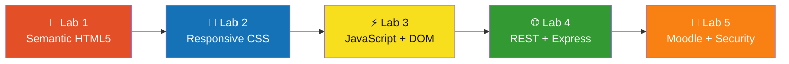
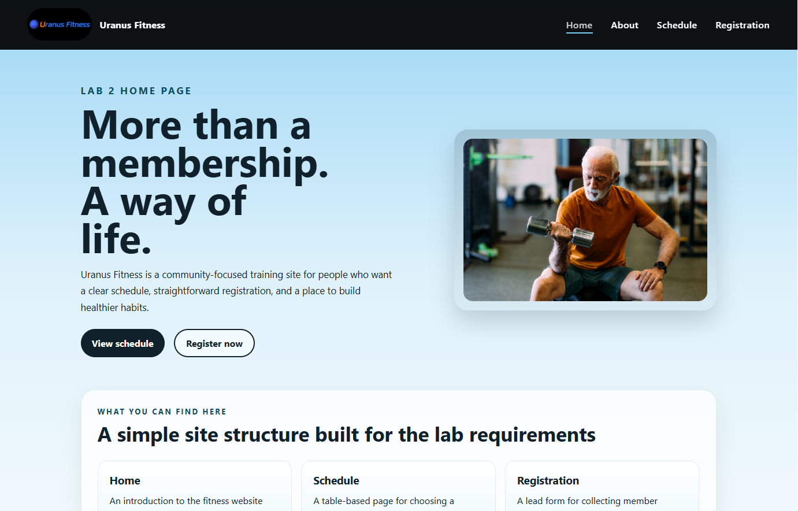
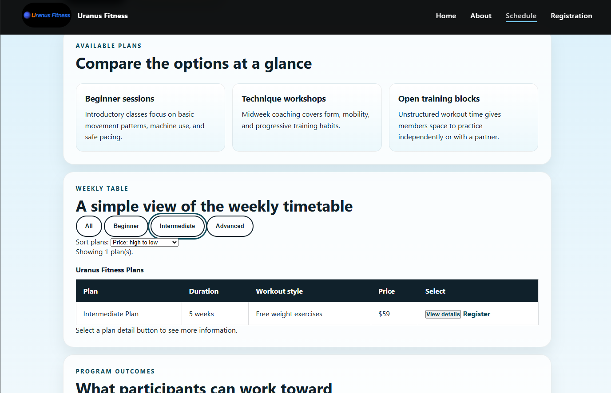
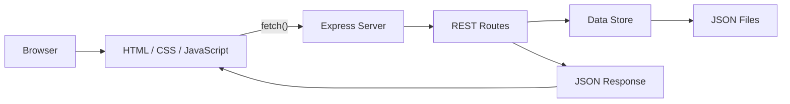
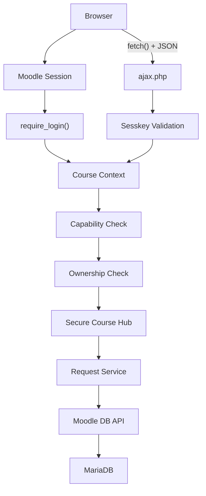
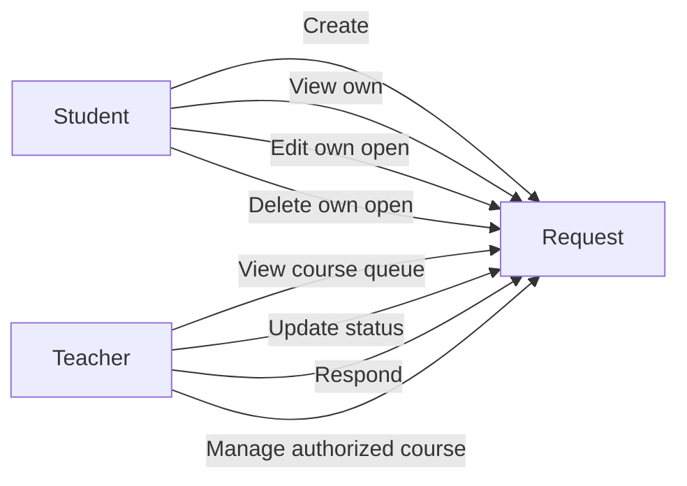
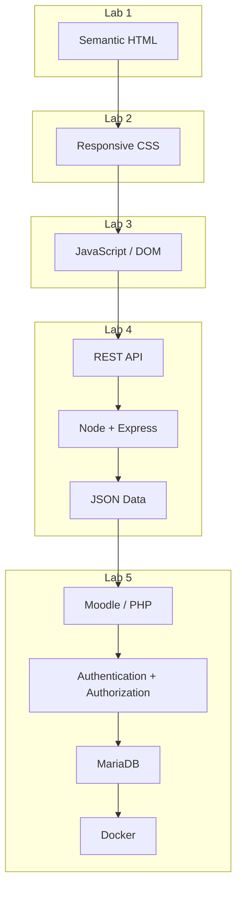

<div align="center">

# 🌐 CSI 3140

## WWW Structures, Techniques & Standards

### From Semantic HTML → Responsive CSS → JavaScript → REST APIs → Secure Web Applications

<p>
  <strong>University of Ottawa · Spring/Summer 2026 · Group 55</strong>
</p>

<br>


<br>


<br>

<a href="#-project-overview"><kbd>Overview</kbd></a> <a href="#-course-journey"><kbd>Course Journey</kbd></a> <a href="#-visual-tour"><kbd>Visual Tour</kbd></a> <a href="#-lab-details"><kbd>Labs</kbd></a> <a href="#-architecture-evolution"><kbd>Architecture</kbd></a> <a href="#-quick-start"><kbd>Run It</kbd></a> <a href="#-contributors"><kbd>Contributors</kbd></a>

</div>

---

# 🚀 Project Overview

This repository contains the completed laboratory work for **CSI 3140 — WWW Structures, Techniques and Standards** at the **University of Ottawa**.

Rather than treating each laboratory as an isolated exercise, the work progressively builds a modern understanding of Web development.

The first four labs evolve **Uranus Fitness**, a fictional fitness platform, from a semantic multi-page HTML website into a responsive, interactive and full-stack Web application.

The final laboratory moves into **secure server-side Web development** through a Moodle plugin called **Secure Course Hub**, introducing authentication, authorization, ownership controls, AJAX/JSON communication, database access and Web security.

> **Five labs. One progression. From markup to full-stack security.**

---

# 🧭 Course Journey



<br>

|                                    Lab                                    | Focus                     | Major Concepts                                     | Status |
| :-----------------------------------------------------------------------: | ------------------------- | -------------------------------------------------- | :----: |
|                            [**Lab 1**](./Lab1)                            | Web Foundations           | HTML5, semantics, forms, accessibility, navigation |    ✅   |
|                            [**Lab 2**](./Lab2)                            | Responsive Design         | CSS3, Box Model, Flexbox, Grid, media queries      |    ✅   |
|                            [**Lab 3**](./Lab3)                            | Client-Side Programming   | JavaScript, DOM, events, validation, localStorage  |    ✅   |
|                            [**Lab 4**](./Lab4)                            | Client-Server Development | Node.js, Express, REST, JSON, Fetch API, OpenAPI   |    ✅   |
| [**Lab 5**](./Lab%205/CSI3140_Lab5_Working_Package/secure-course-hub-lab) | Secure Web Applications   | Moodle, PHP, RBAC, CSRF, XSS, AJAX, Docker         |    ✅   |

---

# 📸 Visual Tour

## Uranus Fitness

<p align="center">
  
  
</p>

<p align="center">
  <em>Responsive Uranus Fitness interface after HTML, CSS and JavaScript development.</em>
</p>

<br>

## Secure Course Hub

<p align="center">
  
</p>

<p align="center">
  <em>Authenticated Moodle Secure Course Hub interface.</em>
</p>

---

# 🧪 Lab Details

<details>
<summary><strong>🧱 Lab 1 — Web Foundations & Semantic HTML5</strong></summary>

<br>

### Goal

Build the foundation of the Uranus Fitness website using standards-compliant and accessibility-aware HTML5.

### Pages

| Page                | Purpose                       |
| ------------------- | ----------------------------- |
| `index.html`        | Home and introduction         |
| `about.html`        | Club information              |
| `schedule.html`     | Membership plans and schedule |
| `registration.html` | Accessible registration form  |

### Concepts Demonstrated

* Semantic HTML5 structure
* `<header>`, `<nav>`, `<main>`, `<section>` and `<footer>`
* Relative navigation
* Internal and external links
* Images with meaningful `alt` attributes
* Lists and structured content
* Accessible tables
* Form labels and input controls
* HTML5 validation
* Logical heading hierarchy
* Keyboard-friendly navigation
* Accessibility-aware markup
* HTML validation

### Result

The project begins as a clean, accessible multi-page website with a strong semantic foundation.

<p align="right">
  <a href="./Lab1"><strong>Open Lab 1 →</strong></a>
</p>

</details>

---

<details>
<summary><strong>🎨 Lab 2 — CSS, Flexbox, Grid & Responsive Design</strong></summary>

<br>

### Goal

Transform the Lab 1 HTML foundation into a polished responsive interface.

### CSS Architecture

The shared stylesheet introduces reusable layout and component patterns for:

* Navigation
* Hero sections
* Feature cards
* Content panels
* Forms
* Tables
* Buttons
* Responsive layouts

### Layout Technologies

| Technology           | Usage                                          |
| -------------------- | ---------------------------------------------- |
| **CSS Box Model**    | Spacing, sizing, padding and borders           |
| **Flexbox**          | Navigation, buttons and horizontal alignment   |
| **CSS Grid**         | Hero layouts, cards and form fields            |
| **Media Queries**    | Mobile and tablet layouts                      |
| **Responsive Units** | `rem`, `%`, `fr`, `min()`, `calc()`, `clamp()` |

### Responsive Behaviour

The interface adapts across:

📱 Mobile
💻 Tablet
🖥️ Desktop

Multi-column layouts collapse into single-column layouts when screen space becomes limited.

Images remain responsive and tables are protected from breaking the page layout.

### Design Direction

* Light blue visual theme
* Deep blue primary interface colour
* Teal accents
* Reusable cards and panels
* Rounded components
* Consistent spacing
* Responsive typography

<p align="right">
  <a href="./Lab2"><strong>Open Lab 2 →</strong></a>
</p>

</details>

---

<details>
<summary><strong>⚡ Lab 3 — JavaScript, DOM & Event-Driven Interfaces</strong></summary>

<br>

### Goal

Turn the static responsive website into an interactive client-side application.

### Interactive Features

#### 🏠 Home Page

**Welcome Modal**

* Dynamically created through JavaScript
* Triggered on page load
* Dismissed through user interaction
* Uses `localStorage` to remember whether the visitor has already seen it

#### ℹ️ About Page

**Accordion FAQ**

* Expandable FAQ sections
* Click-driven interaction
* Uses `aria-expanded`
* CSS state changes
* Keyboard-friendly behaviour

#### 📅 Schedule Page

**Dynamic Membership Plans**

* Plans stored in an array of objects
* Filter by membership level
* Sort by price
* Sort by duration
* Dynamically render table rows
* Display selected plan details
* Update UI without page navigation

#### 📝 Registration Page

**JavaScript Form Validation**

* Required field checks
* Email validation
* Phone validation
* Inline error messages
* Invalid submissions blocked
* Success confirmation
* Dynamic DOM updates

### JavaScript Concepts

```text
DOM Selection
      ↓
Event Listeners
      ↓
Application State
      ↓
Validation / Filtering
      ↓
DOM Updates
      ↓
User Feedback
```

Additional implementation concepts include:

* `DOMContentLoaded`
* Event delegation
* `classList`
* `aria-current`
* `aria-pressed`
* `localStorage`
* Arrays and objects
* Reusable functions
* Regular expressions
* Dynamic element creation

<p align="right">
  <a href="./Lab3"><strong>Open Lab 3 →</strong></a>
</p>

</details>

---

<details>
<summary><strong>🌐 Lab 4 — Node.js, Express & REST APIs</strong></summary>

<br>

### Goal

Move Uranus Fitness from a browser-only application into a real **client-server architecture**.

### Full-Stack Architecture



### Backend

Built using:

* Node.js
* Express.js
* REST architecture
* JSON request/response bodies
* Server-side validation
* HTTP status codes
* Modular API routes

### API

#### System

| Method | Endpoint      | Purpose           |
| ------ | ------------- | ----------------- |
| `GET`  | `/api/status` | API health/status |

#### Training Plans

| Method | Endpoint         | Purpose       |
| ------ | ---------------- | ------------- |
| `GET`  | `/api/plans`     | Get all plans |
| `GET`  | `/api/plans/:id` | Get one plan  |

#### Registrations

| Method   | Endpoint                 | Purpose              |
| -------- | ------------------------ | -------------------- |
| `GET`    | `/api/registrations`     | List registrations   |
| `GET`    | `/api/registrations/:id` | Get registration     |
| `POST`   | `/api/registrations`     | Create registration  |
| `PUT`    | `/api/registrations/:id` | Replace registration |
| `PATCH`  | `/api/registrations/:id` | Update registration  |
| `DELETE` | `/api/registrations/:id` | Delete registration  |

### API Documentation

The application includes:

* OpenAPI specification
* Swagger UI
* Documented routes
* Request schemas
* Response schemas
* Status codes

Swagger is available when the application is running at:

```text
http://localhost:3000/api-docs
```

### Client ↔ Server Communication

The frontend communicates with Express using the Fetch API.

```javascript
fetch("/api/plans")
    ↓
Express Route
    ↓
JSON Data
    ↓
Browser
    ↓
Dynamic DOM Update
```

### Server-Side Validation

Registration input is validated before being accepted.

Typical responses include:

```text
200 / 201 → Success
400       → Invalid request
404       → Resource not found
```

<p align="right">
  <a href="./Lab4"><strong>Open Lab 4 →</strong></a>
</p>

</details>

---

<details>
<summary><strong>🔐 Lab 5 — Secure Course Hub / Moodle Plugin</strong></summary>

<br>

### Goal

Build a secure Moodle local plugin where students can create course-help requests and authorized teachers can manage them.

This lab moves beyond ordinary frontend/backend development into:

> **Authentication + Authorization + Ownership + Web Security**

### Environment


### Secure Course Hub Architecture



### Security Controls

| Threat / Requirement        | Protection                          |
| --------------------------- | ----------------------------------- |
| Unauthenticated access      | Moodle sessions + `require_login()` |
| Broken authorization        | Moodle capability checks            |
| Cross-user access           | Record ownership verification       |
| CSRF                        | Moodle `sesskey` validation         |
| XSS                         | Escaped PHP output + `textContent`  |
| SQL injection               | Moodle `$DB` API                    |
| Invalid status values       | Server-side whitelist               |
| Information leakage         | Safe error responses                |
| Excessive teacher responses | 500-character server limit          |
| Client manipulation         | Server-side validation              |

### Capabilities

```text
local/securecoursehub:viewown
local/securecoursehub:createrequest
local/securecoursehub:managecourserequests
```

### Roles



### AJAX / JSON

Teacher status updates are performed dynamically using:

```text
Browser
   ↓
fetch()
   ↓
JSON POST
   ↓
ajax.php
   ↓
Authentication
   ↓
Sesskey
   ↓
Capabilities
   ↓
Database
   ↓
JSON Response
   ↓
DOM Update
```

No page reload is required.

### Automated Security Testing

<div align="center">


</div>

The automated suite verifies:

* Unauthenticated access rejection
* Unauthorized API access rejection
* Valid request creation
* Required-field validation
* Maximum title length
* User data isolation
* Ownership enforcement
* Teacher-only operations
* Course request visibility
* Status updates
* 500-character teacher response limit
* Missing/forged sesskey rejection
* XSS payload rendering as text
* Safe 404 responses
* Status whitelist enforcement

### Security Evidence

<p align="center">
  
  
</p>

<p align="right">
  <a href="./Lab%205/CSI3140_Lab5_Working_Package/secure-course-hub-lab"><strong>Open Lab 5 →</strong></a>
</p>

</details>

---

# 🏗️ Architecture Evolution

The repository demonstrates how a Web application grows layer by layer.



---

# 🧠 Skills Demonstrated

<table>
<tr>
<td width="33%" valign="top">

### 🎨 Frontend

* Semantic HTML5
* CSS3
* Responsive design
* Flexbox
* Grid
* Forms
* Accessibility
* DOM manipulation
* Event handling

</td>

<td width="33%" valign="top">

### ⚙️ Backend

* Node.js
* Express.js
* PHP
* REST API design
* JSON
* HTTP methods
* Status codes
* Server validation
* Data persistence

</td>

<td width="33%" valign="top">

### 🔐 Security & DevOps

* Authentication
* Authorization
* RBAC
* Ownership checks
* CSRF protection
* XSS mitigation
* Docker
* MariaDB
* Automated security tests

</td>
</tr>
</table>

---

# ▶️ Quick Start

## Clone the Repository

```bash
git clone https://github.com/bhar007-neel/3104-Labs-WWW-Structures-and-Standards.git

cd 3104-Labs-WWW-Structures-and-Standards
```

---

<details>
<summary><strong>Run Labs 1–3</strong></summary>

<br>

Labs 1–3 are primarily browser-based.

Open the desired lab folder and launch:

```text
index.html
```

For a better development experience, use a local development server such as VS Code Live Server.

</details>

---

<details>
<summary><strong>Run Lab 4</strong></summary>

<br>

```bash
cd Lab4

npm install

npm start
```

Application:

```text
http://localhost:3000
```

Swagger API documentation:

```text
http://localhost:3000/api-docs
```

</details>

---

<details>
<summary><strong>Run Lab 5</strong></summary>

<br>

Navigate to:

```bash
cd "Lab 5/CSI3140_Lab5_Working_Package/secure-course-hub-lab"
```

Start the environment:

```bash
docker compose up -d
```

Setup the Moodle plugin:

```bash
./setup.sh
```

Windows PowerShell alternative:

```powershell
powershell -ExecutionPolicy Bypass -File setup.ps1
```

Run the automated security tests:

```bash
./tests/run_security_tests.sh
```

Expected result:

```text
Automated tests: 17 passed, 0 failed, 17 total
```

</details>

---

# 📂 Repository Structure

```text
3104-Labs-WWW-Structures-and-Standards/
│
├── Lab1/
│   └── Semantic HTML5 + accessibility
│
├── Lab2/
│   └── Responsive CSS + Flexbox + Grid
│
├── Lab3/
│   └── JavaScript + DOM + validation
│
├── Lab4/
│   ├── public/
│   ├── routes/
│   ├── data/
│   ├── api-docs/
│   ├── server.js
│   └── package.json
│
├── Lab 5/
│   └── CSI3140_Lab5_Working_Package/
│       └── secure-course-hub-lab/
│           ├── plugin/
│           ├── tests/
│           ├── report/
│           ├── screenshots/
│           ├── docker-compose.yml
│           ├── setup.sh
│           └── package.sh
│
└── README.md
```

---

# 🧪 Testing & Validation

The work across the repository includes:

* HTML validation
* CSS validation
* Browser developer tools
* Desktop testing
* Tablet testing
* Mobile testing
* Keyboard navigation testing
* JavaScript console testing
* Form validation testing
* REST API testing
* Valid and invalid API requests
* HTTP error handling
* API documentation verification
* Automated authentication tests
* Authorization tests
* Ownership tests
* CSRF tests
* XSS tests

---

# 🔄 Development Progression

```text
HTML
  ↓
Semantic Structure
  ↓
Accessibility
  ↓
CSS
  ↓
Responsive Layout
  ↓
JavaScript
  ↓
Dynamic Interfaces
  ↓
HTTP / Fetch
  ↓
REST APIs
  ↓
Node.js / Express
  ↓
Server Validation
  ↓
Authentication
  ↓
Authorization
  ↓
Web Security
  ↓
Containerized Deployment
```

---

# 👥 Contributors

<table>
<tr>

<td align="center" width="33%">
<a href="https://github.com/bhar007-neel">

<br />
<strong>Neelmani Bhardwaj</strong>
</a>
<br />
<a href="https://github.com/bhar007-neel">@bhar007-neel</a>
</td>

<td align="center" width="33%">
<a href="https://github.com/liamg2187">

<br />
<strong>Liam Geraghty</strong>
</a>
<br />
<a href="https://github.com/liamg2187">@liamg2187</a>
</td>

<td align="center" width="33%">
<a href="https://github.com/DaKarfiG">

<br />
<strong>David Gvozdyev</strong>
</a>
<br />
<a href="https://github.com/DaKarfiG">@DaKarfiG</a>
</td>

</tr>
</table>

---

# 🎓 Course

**CSI 3140 — WWW Structures, Techniques and Standards**

University of Ottawa
Faculty of Engineering
School of Electrical Engineering and Computer Science

**Term:** Spring/Summer 2026
**Group:** 55

---

<div align="center">

## ✅ 5 / 5 Labs Completed

### Semantic Web → Responsive UI → Interactive JavaScript → REST APIs → Secure Web Applications

<br>


<br><br>

**Built through five progressive CSI 3140 laboratory projects.**

<br>

<a href="#-csi-3140">⬆ Back to top</a>

</div>

